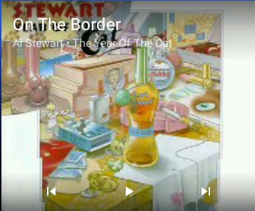

# Vinyl Music Player Big Buttons

As mentioned in the README.md: This is Adrien Poupa's Vinyl Music Player. As I'm using it on an Android head unit, I wanted bigger buttons.
That is the only change. It comes down to creating a few extra "drawable" xml files and adapting a few layout xmls and a few java files to use these added drawable xmls.

Main screen:
**Original**

**Bigger Buttons**

**Original widget** 
 
**Bigger Buttons widget** 

